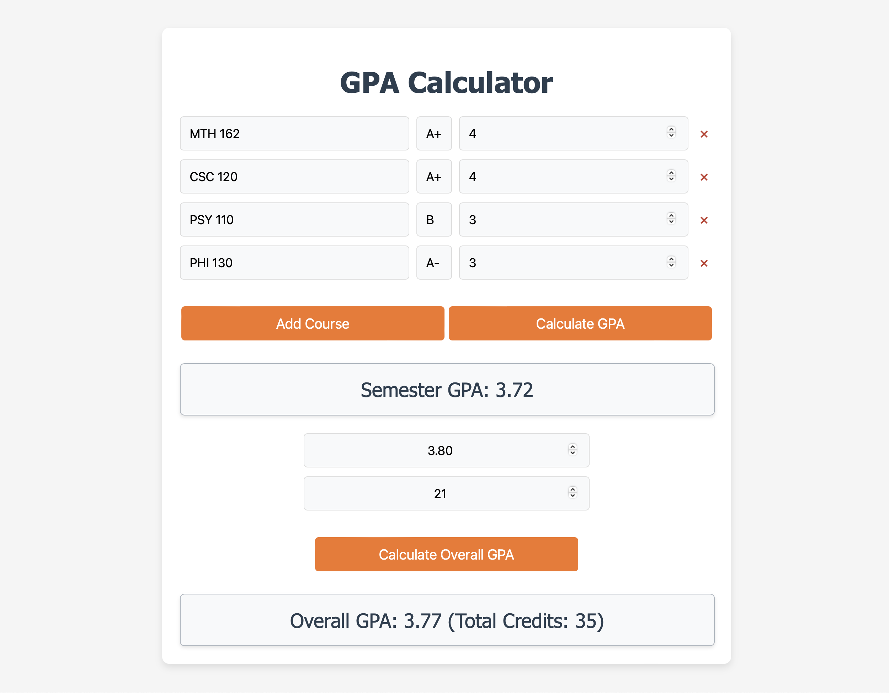

# GPA Calculator Web App

## Overview

This web app allows users to calculate their semester and overall GPA. It is a simple and user-friendly application designed for students to easily manage and calculate their academic performance.

## Features

-   Add and remove courses with ease.
-   Input course grades and credit hours.
-   Calculate semester GPA.
-   Calculate cumulative overall GPA based on current GPA and total credits earned.

## How to Use

1. **Add a Course**: Click on the "Add Course" button to add a new course input group.
2. **Enter Course Details**: For each course, enter the course name, select the grade received, and input the credit hours.
3. **Calculate Semester GPA**: Click on the "Calculate GPA" button to see your semester GPA based on the courses added.
4. **Calculate Overall GPA**:
    - Enter your current overall GPA and total credits earned before this semester in the provided fields.
    - Click on the "Calculate Overall GPA" button to see your updated overall GPA including this semester's grades.

## Technologies Used

-   HTML
-   CSS
-   JavaScript

## Preview

The web app is live at [GPA Calculator](https://av1155.github.io/GPA-Calculator-Webapp/).

## Development

This project is open for suggestions and contributions. Feel free to fork this repository and submit pull requests.

## Author

-   Andrea A. Venti Fuentes

## License

This project is open source and available under the [MIT License](LICENSE).
